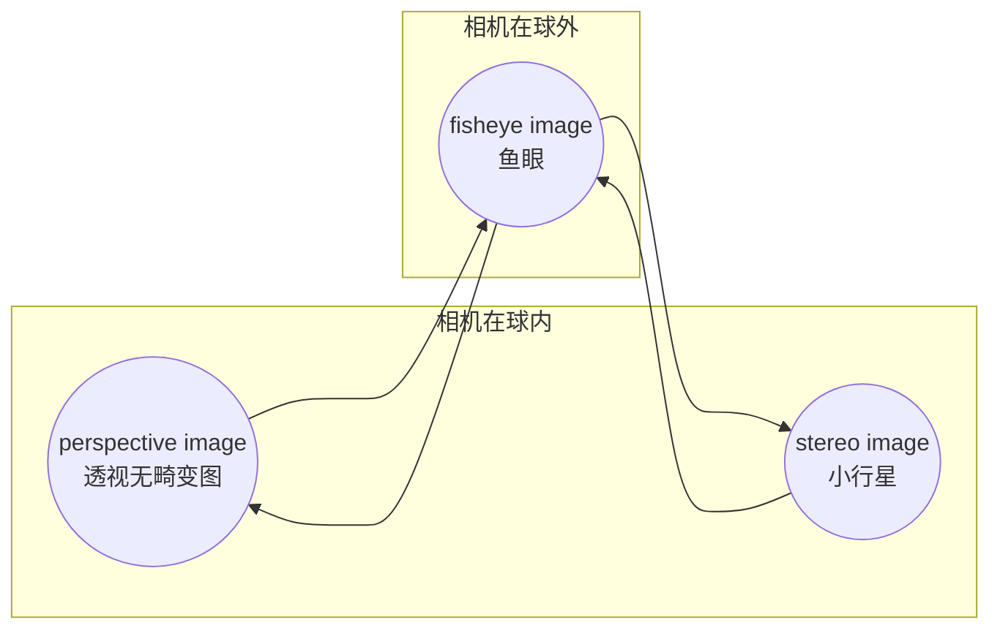

# 交互制作特效视频编辑器

导入equirectangular类型全景视频，用户在不同时间戳上选择视角，自动插值生成预览特效视频，可导出mp4文件

## References

1. [Changes in camera viewpoint parameters cannot be constrained within the axial coordinate area?](https://ww2.mathworks.cn/matlabcentral/answers/2152210-changes-in-camera-viewpoint-parameters-cannot-be-constrained-within-the-axial-coordinate-area)

1. [Create an App to Play and Visualize Audio Files](https://www.mathworks.com/help/audio/ug/create-an-app-to-play-and-visualize-audio-files.html)
