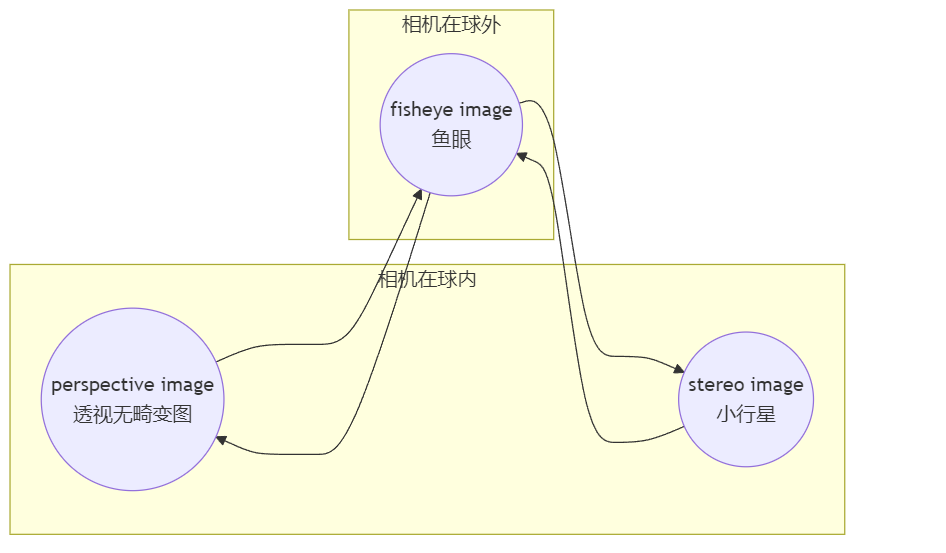
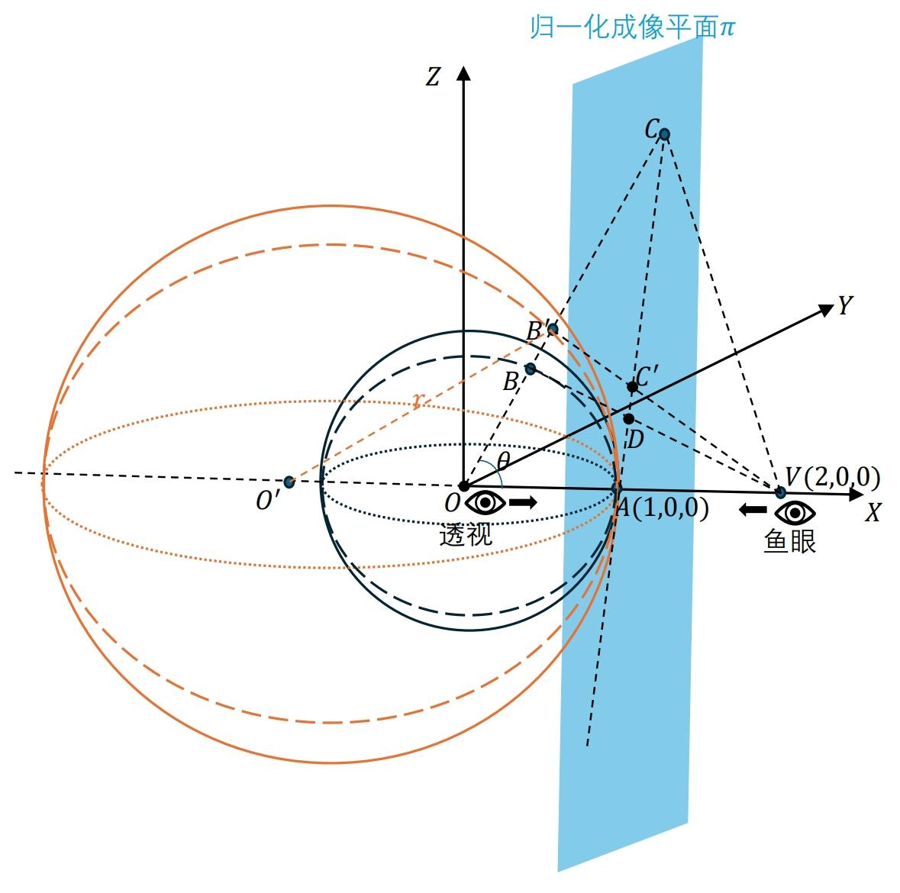
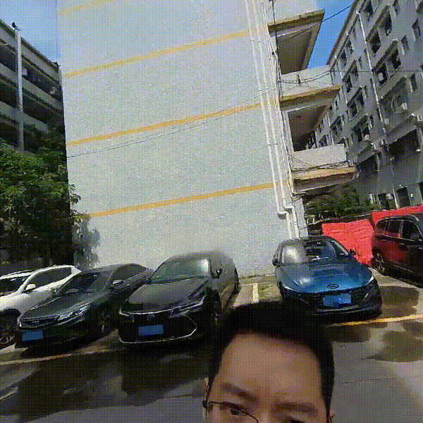
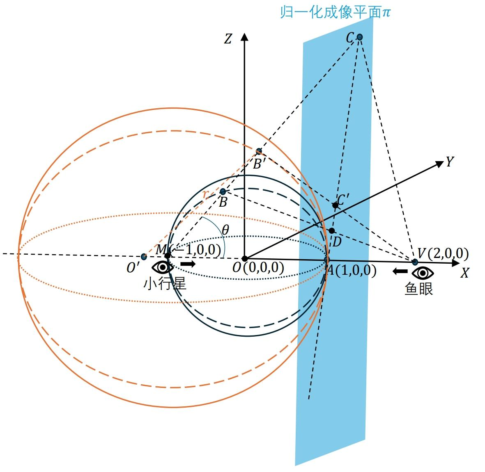
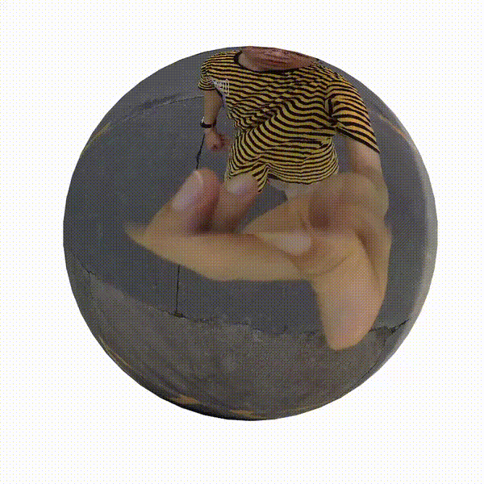
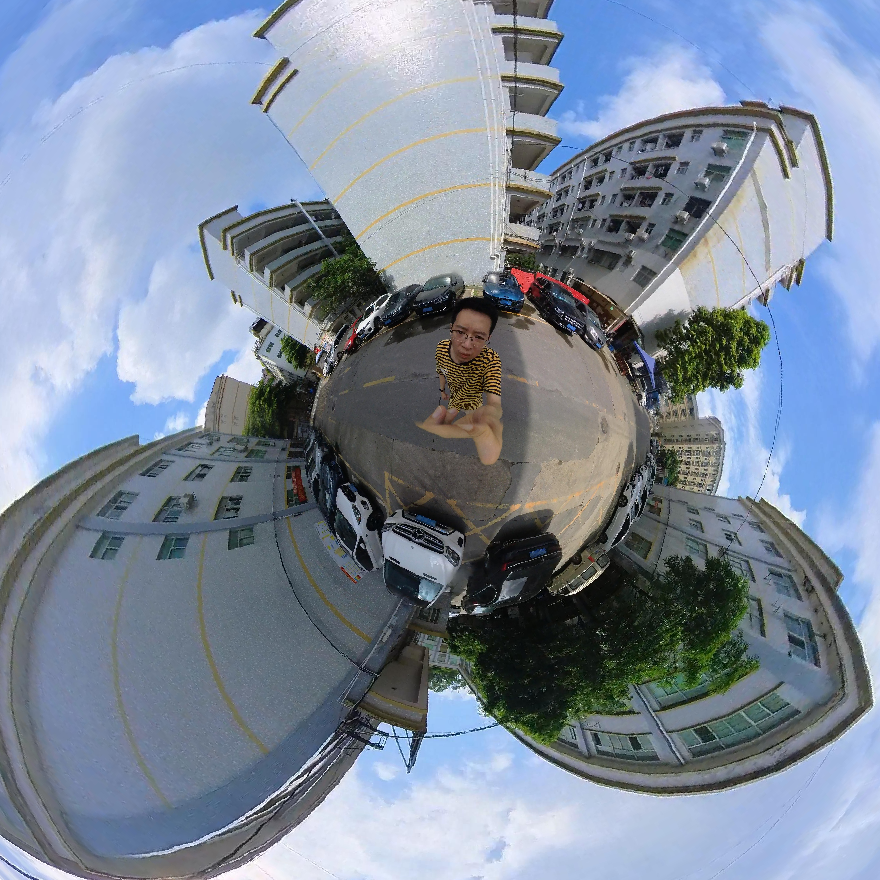

# 360°全景球内外图像顺滑过渡算法

算法核心思想：横看成岭侧成峰，远近高低各不同！

author:崔星星

<cuixingxing150@gmail.com>

date:2024.9.24

# OverView

本示例展示了360°全景图像在单位球面的纹理渲染平滑过渡算法，重点阐述了球体内外相机位置、方向发生突变的情况下，依旧能保证渲染图像可以平滑过渡转换，视觉上不会引起画面突变切换障碍。球体内外过渡在3种典型模式("fisheye","perspective","stereo")下主要表现为下图中的4种箭头转换关系，详细给出了算法原理和代码实践！



<a name="beginToc"></a>

## 目录

&emsp;[OverView](#overview)

&emsp;[透视与鱼眼相互转换](#透视与鱼眼相互转换)

&emsp;&emsp;[问题描述](#问题描述)

&emsp;&emsp;[问题求解](#问题求解)

&emsp;&emsp;[代码实践](#代码实践)

&emsp;&emsp;&emsp;[公式推导](#公式推导)

&emsp;&emsp;&emsp;[算法实现](#算法实现)

&emsp;[小行星与鱼眼相互转换](#小行星与鱼眼相互转换)

&emsp;&emsp;[问题描述](#问题描述)

&emsp;&emsp;[问题求解](#问题求解)

&emsp;&emsp;[代码实践](#代码实践)

&emsp;&emsp;&emsp;[公式推导](#公式推导)

&emsp;&emsp;&emsp;[算法实现](#算法实现)

<a name="endToc"></a>

# 透视与鱼眼相互转换

## 问题描述

为了能够较顺滑的在透视和鱼眼两种视角平滑过渡渲染，数学上表现为单位球体内，外之间视角变换，不能简单的对各个变量进行线性插值(仅适用球体内的小行星和透视之间的模式)，我特意画出如下成像示意图：



两种视角模式：

- 从球心 $O\left(0,0,0\right)$ 向目标点 $A\left(1,0,0\right)$ 方向观看，黑色的单位球面纹理在归一化成像平面 $\pi$ 上的投影为透视无畸变投影（[Gnomonic projection](https://en.wikipedia.org/wiki/Gnomonic_projection)）
- 从点 $V\left(2,0,0\right)$ 向目标点 $A\left(1,0,0\right)$ 方向观看，黑色的单位球面纹理在归一化成像平面 $\pi$ 上的投影为鱼眼投影（[Fisheye Projection](https://wiki.panotools.org/Fisheye_Projection)）

要在上述两种模式之间使得观察图像平滑过渡，那么每个投影像素点坐标要连续变化，即不能突变，表现在投影成像平面 $\pi$ 上的无畸变点 $C$ (从点 $O$ 看，点 $B$ 在平面 $\pi$ 上的投影点)和畸变点 $D$ (从点 $V$ 看，点 $B$ 在平面 $\pi$ 上的投影点)之间的顺滑过渡。橙色大球体是一个半径 $r\in \left\lbrack 1,\inf \right\rbrack$ 范围，球心 $O^{\prime }$ 位于 $X$ 负半轴，并且始终与点 $A$ 相切不断变化的球体。黑色小球体是一个半径为1，位置始终固定的单位球体，其表面纹理为一副360° [equirectangular类型](https://en.wikipedia.org/wiki/Equirectangular_projection)全景渲染图像，点 $B$ 为单位球体纹理表面上任意一点，在点 $O$ 沿着视线方向看，即延长 $\textrm{OB}$ 与橙色大球体表面相交于点 $B^{\prime }$ ,与平面 $\pi$ 相交于点 $C$ ，连接点 $B^{\prime }$ 和点 $V$ ，与平面 $\pi$ 相交于点 $C^{\prime }$ ，当橙色大球体半径逐渐变动时，那么点 $C^{\prime }$ 即为过渡变化点。由简单的几何关系可知，点 $C$ , $C^{\prime }$ , $D$ , $A$ 四点始终共线。

相应地，**单位球体上弧** $\hat{\textrm{AB}}$ **的纹理映射到橙色大球体上弧** $\hat{A{\mathrm{B}}^{\prime } }$ **,这样从点** $V$ **看，实际点** $B$ **在平面** $\pi$ **上的投影点看起来像是从虚拟点** ${\mathrm{B}}^{\prime }$ **投影到点** $C^{\prime }$ **产生的，从而达到了图像像素点顺滑过渡的效果！**

## 问题求解

现问题变为：已知点 $B$ 坐标为 $\left(x_0 ,y_0 ,z_0 \right)$ ,摄像机视场角为 $\theta$ ，即图中 $\angle \textrm{COV}=\theta$ ， $\|O^{\prime } B^{\prime } \parallel =r$ ，求虚拟点 $B^{\prime }$ 的坐标 $\left(x,y,z\right)$ 。

在 $\bigtriangleup O^{\prime } O{\mathrm{B}}^{\prime }$ 中，设 $\|OB^{\prime } \parallel =l$ ,利用三角形余弦公式，可知：

 $$ r^2 ={\left(r-1\right)}^2 +l^2 -2l\left(r-1\right)\cos \left(\pi -\theta \right) $$

可求解 $l$ (只有一个有效解)，然后利用等比关系，进而可求解得到点 $B^{\prime }$ 的坐标如下：

 $$ \left\lbrace \begin{array}{ll} x= & l*\cos \left(\theta \right)\newline y= & \frac{y_0 *l*\cos \left(\theta \right)}{x_0 }\newline z= & \frac{z_0 *l*\cos \left(\theta \right)}{x_0 } \end{array}\right. $$

## 代码实践

### 公式推导

```matlab
syms r l theta
equ = r.^2==(r-1).^2+l.^2-2*l*(r-1).*cos(pi-theta)
```

equ =
 $\displaystyle r^2 ={{\left(r-1\right)}}^2 +l^2 +2\,l\,\cos \left(\theta \right)\,{\left(r-1\right)}$

```matlab

sol = solve(equ,l)
```

sol =
 $\displaystyle \left(\begin{array}{c} \cos \left(\theta \right)+\sqrt{r^2 \,{\cos \left(\theta \right)}^2 -2\,r\,{\cos \left(\theta \right)}^2 +2\,r+{\cos \left(\theta \right)}^2 -1}-r\,\cos \left(\theta \right)\newline \cos \left(\theta \right)-\sqrt{r^2 \,{\cos \left(\theta \right)}^2 -2\,r\,{\cos \left(\theta \right)}^2 +2\,r+{\cos \left(\theta \right)}^2 -1}-r\,\cos \left(\theta \right) \end{array}\right)$

从求解的结果sol看出有2个解，取其中一个有效解：

```matlab
l = sol(1)
```

l =
 $\displaystyle \cos \left(\theta \right)+\sqrt{r^2 \,{\cos \left(\theta \right)}^2 -2\,r\,{\cos \left(\theta \right)}^2 +2\,r+{\cos \left(\theta \right)}^2 -1}-r\,\cos \left(\theta \right)$

带入最终公式，得到点 $B^{\prime }$ 的坐标 $\left(x,y,z\right)$ 如下：

```matlab
syms x_0 y_0 z_0
x = l*cos(theta)
```

x =
 $\displaystyle \cos \left(\theta \right)\,{\left(\cos \left(\theta \right)+\sqrt{r^2 \,{\cos \left(\theta \right)}^2 -2\,r\,{\cos \left(\theta \right)}^2 +2\,r+{\cos \left(\theta \right)}^2 -1}-r\,\cos \left(\theta \right)\right)}$

```matlab
y = y_0*x/x_0
```

y =
 $\displaystyle \frac{y_0 \,\cos \left(\theta \right)\,{\left(\cos \left(\theta \right)+\sqrt{r^2 \,{\cos \left(\theta \right)}^2 -2\,r\,{\cos \left(\theta \right)}^2 +2\,r+{\cos \left(\theta \right)}^2 -1}-r\,\cos \left(\theta \right)\right)}}{x_0 }$

```matlab
z = z_0*x/x_0
```

z =
 $\displaystyle \frac{z_0 \,\cos \left(\theta \right)\,{\left(\cos \left(\theta \right)+\sqrt{r^2 \,{\cos \left(\theta \right)}^2 -2\,r\,{\cos \left(\theta \right)}^2 +2\,r+{\cos \left(\theta \right)}^2 -1}-r\,\cos \left(\theta \right)\right)}}{x_0 }$

```matlab
x = subs(x,theta,pi/6)
```

x =
 $\displaystyle \frac{\sqrt{3}\,{\left(\frac{\sqrt{3}}{2}-\frac{\sqrt{3}\,r}{2}+\sqrt{\frac{3\,r^2 }{4}+\frac{r}{2}-\frac{1}{4}}\right)}}{2}$

```matlab
vpa(limit(x,r,inf))
```

ans =
 $\displaystyle 1.0$

当 $\theta =\frac{\pi }{6}$ ， $r$ 趋向于无穷大时，可以看到比较接近成像平面 $\pi$ 了，就更接近于透视视图。

### 算法实现

把上述推导出的点 $B^{\prime }$ 的坐标 $\left(x,y,z\right)$ 公式代入计算，并任意读取一副360° equirectangular类型全景图像并进行渲染，动态透视转换鱼眼效果如下：

```matlab
%% 演示透视转鱼眼，光滑过渡效果！
[X,Y,Z] = sphere(50);
figure(Position=[20,20,800,800]);
ax = gca;
% mesh(ax,X,Y,Z)
hold(ax,"on");
ax.DataAspectRatio = [1,1,1];
axis(ax,"off");

%% 纹理
frame = imread("https://raw.githubusercontent.com/cuixing158/360-panorama-viewer-app/main/data/360panorama.jpg");
s = surf(ax,X,Y,Z,frame,'FaceColor','texture','EdgeColor','none');
ax.Projection="perspective";
ax.CameraPosition = [2,0,0];
ax.CameraViewAngle=60;
ax.CameraUpVector = [0,0,-1];
ax.CameraTarget = [1,0,0];

maskCoord = s.XData>cosd(180/2);
XData = s.XData(maskCoord);
YData = s.YData(maskCoord);
ZData = s.ZData(maskCoord);

theta = acosd(XData);
k = 0.01:0.05:1;
for r = 1./k
    % 根据上述公式计算
    x = cosd(theta).*(cosd(theta) + sqrt(r.^2.*cosd(theta).^2 - 2*r.*cosd(theta).^2 + 2*r + cosd(theta).^2 - 1) - r.*cosd(theta));
    y = (YData.*x)./XData;
    z = (ZData.*x)./XData;

    s.XData(maskCoord) = x;
    s.YData(maskCoord) = y;
    s.ZData(maskCoord) = z;

    drawnow;
end
```



上述代码演示了透视转鱼眼的顺滑效果，但当曲率 $k$ 反向变化时候，那么就可以得到鱼眼到透视的转换顺滑。

# 小行星与鱼眼相互转换

## 问题描述

类似地，小行星和鱼眼之间的转换关系我画出如下成像示意图：



两种视角模式：

- 从点 $M\left(-1,0,0\right)$ 向目标点 $A\left(1,0,0\right)$ 方向观看，黑色的单位球面纹理在归一化成像平面 $\pi$ 上的投影为透视小行星投影（[Stereographic projection](https://en.wikipedia.org/wiki/Stereographic_projection)）
- 从点 $V\left(2,0,0\right)$ 向目标点 $A\left(1,0,0\right)$ 方向观看，黑色的单位球面纹理在归一化成像平面 $\pi$ 上的投影为鱼眼投影（[Fisheye Projection](https://wiki.panotools.org/Fisheye_Projection)）

要在上述两种模式之间使得观察图像平滑过渡，那么每个投影像素点坐标同样要连续变化，即不能突变，表现在投影成像平面 $\pi$ 上的无畸变点 $C$ (从点 $M$ 看，点 $B$ 在平面 $\pi$ 上的投影点)和畸变点 $D$ (从点 $V$ 看，点 $B$ 在平面 $\pi$ 上的投影点，当然如果点 $B$ 能被点 $V$ 看到的话)之间的顺滑过渡。橙色大球体仍然是一个半径 $r\in \left\lbrack 1,\inf \right\rbrack$ 范围，球心 $O^{\prime }$ 位于 $X$ 负半轴，并且始终与点 $A$ 相切不断变化的球体。黑色小球体是一个半径为1，位置始终固定的单位球体，其表面纹理为一副360° [equirectangular类型](https://en.wikipedia.org/wiki/Equirectangular_projection)全景渲染图像，点 $B$ 为单位球体纹理表面上任意一点（除点 $M$ 外），在点 $M$ 沿着视线方向看，即延长 $\textrm{MB}$ 与橙色大球体表面相交于点 $B^{\prime }$ ,与平面 $\pi$ 相交于点 $C$ ，连接点 $B^{\prime }$ 和点 $V$ ，与平面 $\pi$ 相交于点 $C^{\prime }$ ，当橙色大球体半径逐渐变动时，那么点 $C^{\prime }$ 即为过渡变化点。同样，由简单的几何关系可知，点 $C$ , $C^{\prime }$ , $D$ , $A$ 四点始终共线。

相应地，**单位球体上弧** $\hat{\textrm{AB}}$ **的纹理映射到橙色大球体上弧** $\hat{A{\mathrm{B}}^{\prime } }$ **,这样从点** $V$ **看，实际点** $B$ **在平面** $\pi$ **上的投影点看起来像是从虚拟点** ${\mathrm{B}}^{\prime }$ **投影到点** $C^{\prime }$ **产生的，从而达到了图像像素点顺滑过渡的效果！**

## 问题求解

现问题变为：已知点 $B$ 坐标为 $\left(x_0 ,y_0 ,z_0 \right)$ ,摄像机视场角为 $\theta$ ，即图中 $\angle \textrm{CMV}=\theta$ ， $\|MB^{\prime } \parallel =r$ ，求虚拟点 $B^{\prime }$ 的坐标 $\left(x,y,z\right)$ 。

在 $\bigtriangleup O^{\prime } M{\mathrm{B}}^{\prime }$ 中，设 $\|MB^{\prime } \parallel =l$ ,同样，利用三角形余弦公式，可知：

 $$ r^2 ={\left(r-2\right)}^2 +l^2 -2l\left(r-2\right)\cos \left(\pi -\theta \right) $$

可求解 $l$ (只有一个有效解)，然后利用等比关系，进而可求解得到点 $B^{\prime }$ 的坐标如下：

 $$ \left\lbrace \begin{array}{ll} x\;= & l*\cos \left(\theta \right)-1\newline \frac{y-0}{y_0 -0}= & \frac{x+1}{x_0 +1}\newline \frac{z-0}{z_0 -0}= & \frac{x+1}{x_0 +1} \end{array}\right. $$

上述公式是假定球心 $O^{\prime }$ 在单位球体外，如果在单位球内或者位于点 $M$ ，不妨碍上述公式计算的正确性(读者可自行验证)。

## 代码实践

### 公式推导

```matlab
syms r l theta
equ = r.^2==(r-2).^2+l.^2-2*l*(r-2).*cos(pi-theta)
```

equ =
 $\displaystyle r^2 ={{\left(r-2\right)}}^2 +l^2 +2\,l\,\cos \left(\theta \right)\,{\left(r-2\right)}$

```matlab

sol = solve(equ,l)
```

sol =
 $\displaystyle \left(\begin{array}{c} 2\,\cos \left(\theta \right)-\sqrt{r^2 \,{\cos \left(\theta \right)}^2 -4\,r\,{\cos \left(\theta \right)}^2 +4\,r+4\,{\cos \left(\theta \right)}^2 -4}-r\,\cos \left(\theta \right)\newline 2\,\cos \left(\theta \right)+\sqrt{r^2 \,{\cos \left(\theta \right)}^2 -4\,r\,{\cos \left(\theta \right)}^2 +4\,r+4\,{\cos \left(\theta \right)}^2 -4}-r\,\cos \left(\theta \right) \end{array}\right)$

从求解的结果sol看出有2个解，取有效的那个解：

```matlab
l = sol(2)
```

l =
 $\displaystyle 2\,\cos \left(\theta \right)+\sqrt{r^2 \,{\cos \left(\theta \right)}^2 -4\,r\,{\cos \left(\theta \right)}^2 +4\,r+4\,{\cos \left(\theta \right)}^2 -4}-r\,\cos \left(\theta \right)$

带入最终公式，得到点 $B^{\prime }$ 的坐标 $\left(x,y,z\right)$ 如下：

```matlab
syms x_0 y_0 z_0
x = l*cos(theta)-1
```

x =
 $\displaystyle \cos \left(\theta \right)\,{\left(2\,\cos \left(\theta \right)+\sqrt{r^2 \,{\cos \left(\theta \right)}^2 -4\,r\,{\cos \left(\theta \right)}^2 +4\,r+4\,{\cos \left(\theta \right)}^2 -4}-r\,\cos \left(\theta \right)\right)}-1$

```matlab
y = y_0*(x+1)/(x_0+1)
```

y =
 $\displaystyle \frac{y_0 \,\cos \left(\theta \right)\,{\left(2\,\cos \left(\theta \right)+\sqrt{r^2 \,{\cos \left(\theta \right)}^2 -4\,r\,{\cos \left(\theta \right)}^2 +4\,r+4\,{\cos \left(\theta \right)}^2 -4}-r\,\cos \left(\theta \right)\right)}}{x_0 +1}$

```matlab
z = z_0*(x+1)/(x_0+1)
```

z =
 $\displaystyle \frac{z_0 \,\cos \left(\theta \right)\,{\left(2\,\cos \left(\theta \right)+\sqrt{r^2 \,{\cos \left(\theta \right)}^2 -4\,r\,{\cos \left(\theta \right)}^2 +4\,r+4\,{\cos \left(\theta \right)}^2 -4}-r\,\cos \left(\theta \right)\right)}}{x_0 +1}$

```matlab
x = subs(x,theta,pi/3 )
```

x =
 $\displaystyle \frac{\sqrt{\frac{r^2 }{4}+3\,r-3}}{2}-\frac{r}{4}-\frac{1}{2}$

```matlab

limit(x,r,inf)
```

ans =
 $\displaystyle 1$

当给定 $\theta =\frac{\pi }{3}$ 时候， $r$ 趋向于无穷大时候， $x$ 坐标越靠近归一化成像平面，就更接近于小行星视图。

### 算法实现

把上述推导出的点 $B^{\prime }$ 的坐标 $\left(x,y,z\right)$ 公式代入计算，并任意读取一副360° equirectangular类型全景图像并进行渲染，动态鱼眼转小行星效果如下：

```matlab
%% 演示鱼眼转小行星，光滑过渡效果！
[X,Y,Z] = sphere(50);
fig = figure(Position=[20,20,800,800]);
ax = gca;
% mesh(ax,X,Y,Z)
hold(ax,"on");
ax.DataAspectRatio = [1,1,1];
axis(ax,"off")
littlePlanetFov = 150; % 小行星视场角，越大图像越夸张
fisheyeFov = 60; % 鱼眼摄像机观察单位球的视场角

% 纹理和设置相机参数
frame = imread("https://raw.githubusercontent.com/cuixing158/360-panorama-viewer-app/main/data/360panorama.jpg");
s = surf(ax,X,Y,Z,frame,'FaceColor','texture','EdgeColor','none');
ax.Projection="perspective";
ax.CameraPosition = [2,0,0];
ax.CameraUpVector = [0,0,-1];
ax.CameraTarget = [1,0,0];
ax.CameraViewAngle = littlePlanetFov;

% 旋转一定角度，让其有代表性的小行星图
direction = [0,1,0];
rotate(s,direction,90);% 正90度对应地面，-90度对应天空

% 对x正半轴的坐标点做变换即可
maskCoord = s.XData>cosd(360/2);
XData = s.XData(maskCoord);
YData = s.YData(maskCoord);
ZData = s.ZData(maskCoord);

norma = sqrt((XData+1).^2+YData.^2+ZData.^2);
normb = 1;
theta = acosd((XData+1)./(norma*normb));

k = 1:-0.02:0.01;% 曲率变化范围
fovQuerys = interp1([k(1),k(end)],[fisheyeFov,littlePlanetFov],k);
idx = 1;
for r = 1./k
    % 根据上述公式计算
    x = cosd(theta).*(2*cosd(theta) + sqrt(r.^2.*cosd(theta).^2 - 4*r.*cosd(theta).^2 + 4*r + 4*cosd(theta).^2 - 4) - r.*cosd(theta)) - 1;
    y = (YData.*(x+1))./(XData+1);
    z = (ZData.*(x+1))./(XData+1);

    s.XData(maskCoord) = x;
    s.YData(maskCoord) = y;
    s.ZData(maskCoord) = z;

    ax.CameraViewAngle = fovQuerys(idx);
    drawnow;
    idx = idx+1;
end
```



上面动画在小行星视图变化太快，鱼眼视图比较缓慢，怎么做到“快进慢出”？下面对曲率 $k$ 进行对数变换，使动画的小行星变化不要太快。

```matlab
k = logspace(0,-2,50);% 对数变化
fovQuerys = interp1([k(1),k(end)],[fisheyeFov,littlePlanetFov],k);
idx = 1;
for r = 1./k
    % 根据上述公式计算
    x = cosd(theta).*(2*cosd(theta) + sqrt(r.^2.*cosd(theta).^2 - 4*r.*cosd(theta).^2 + 4*r + 4*cosd(theta).^2 - 4) - r.*cosd(theta)) - 1;
    y = (YData.*(x+1))./(XData+1);
    z = (ZData.*(x+1))./(XData+1);

    s.XData(maskCoord) = x;
    s.YData(maskCoord) = y;
    s.ZData(maskCoord) = z;

    ax.CameraViewAngle = fovQuerys(idx);
    drawnow;
    idx = idx+1;
end
```




同样，上述代码演示了鱼眼转小行星的顺滑效果，但当曲率 $k$ 反向变化时候，那么就可以得到小行星转鱼眼的转换顺滑。
